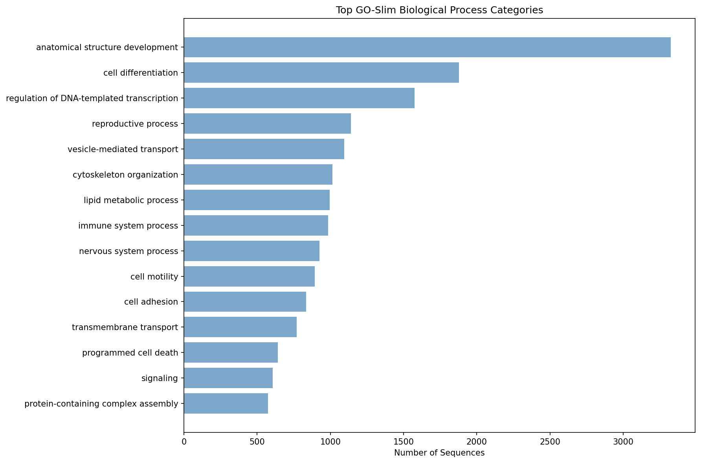

# Annotation Summary Report

## Job Information
- **Input file**: derm-protein.fa
- **Start time**: 2026-03-06 09:58:46
- **End time**: 2026-03-06 11:23:49
- **Duration**: 1h 25m 3s
- **CPUs used**: 40
- **Tool**: BLAST+ BLASTP (protein)

## Results Overview
- **Total sequences**: 20,612
- **BLAST hits found**: 20,612 (100.0%)
- **GO annotations**: 10,411 (50.5%)
- **GO-Slim mappings**: 10,378 (50.3%)

## Output Files
- **Main results**: annotation_with_goslim.tsv
- **Full GO data**: annotation_full_go.tsv  
- **Raw BLAST**: derm-protein.blast.tsv
- **Processing script**: postprocess_uniprot_go.py

## Top GO-Slim Categories

| GO-Slim Term | Count |
|--------------|-------|
| anatomical structure development | 3326 |
| cell differentiation | 1877 |
| regulation of DNA-templated transcription | 1574 |
| reproductive process | 1141 |
| vesicle-mediated transport | 1094 |
| cytoskeleton organization | 1013 |
| lipid metabolic process | 995 |
| immune system process | 985 |
| nervous system process | 925 |
| cell motility | 893 |
| cell adhesion | 835 |
| transmembrane transport | 769 |
| programmed cell death | 641 |
| signaling | 606 |
| protein-containing complex assembly | 573 |

*Top 15 GO-Slim categories by sequence count*

## Performance
- **BLAST throughput**: 4.0 sequences/second
- **Annotation rate**: 4.0 hits/second

---
*Generated by blast2slim.sh on 2026-03-06 11:23:49*
