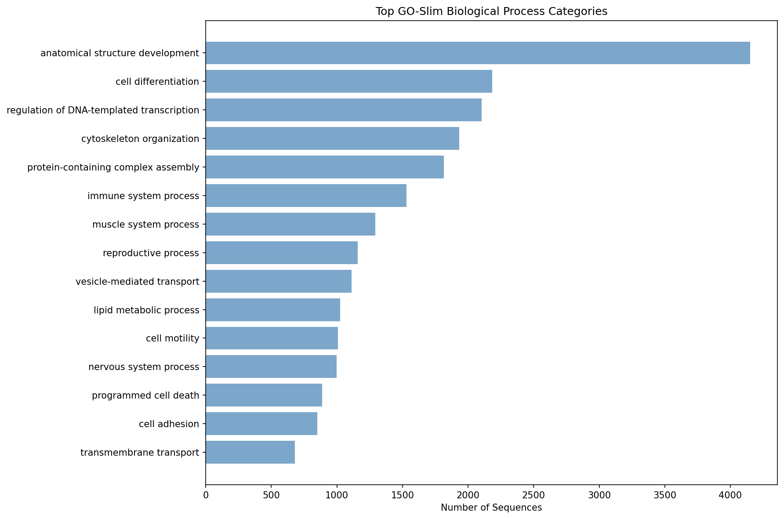

# Annotation Summary Report

## Job Information
- **Input file**: pisaster-protein.fa
- **Start time**: 2026-03-06 21:48:25
- **End time**: 2026-03-06 23:56:38
- **Duration**: 2h 8m 13s
- **CPUs used**: 40
- **Tool**: BLAST+ BLASTP (protein)

## Results Overview
- **Total sequences**: 40,685
- **BLAST hits found**: 40,685 (100.0%)
- **GO annotations**: 12,697 (31.2%)
- **GO-Slim mappings**: 12,652 (31.1%)

## Output Files
- **Main results**: annotation_with_goslim.tsv
- **Full GO data**: annotation_full_go.tsv  
- **Raw BLAST**: pisaster-protein.blast.tsv
- **Processing script**: postprocess_uniprot_go.py

## Top GO-Slim Categories

| GO-Slim Term | Count |
|--------------|-------|
| anatomical structure development | 4152 |
| cell differentiation | 2185 |
| regulation of DNA-templated transcription | 2104 |
| cytoskeleton organization | 1934 |
| protein-containing complex assembly | 1816 |
| immune system process | 1530 |
| muscle system process | 1294 |
| reproductive process | 1157 |
| vesicle-mediated transport | 1111 |
| lipid metabolic process | 1026 |
| cell motility | 1008 |
| nervous system process | 997 |
| programmed cell death | 886 |
| cell adhesion | 850 |
| transmembrane transport | 681 |

*Top 15 GO-Slim categories by sequence count*

## Performance
- **BLAST throughput**: 5.3 sequences/second
- **Annotation rate**: 5.3 hits/second

---
*Generated by blast2slim.sh on 2026-03-06 23:56:38*
