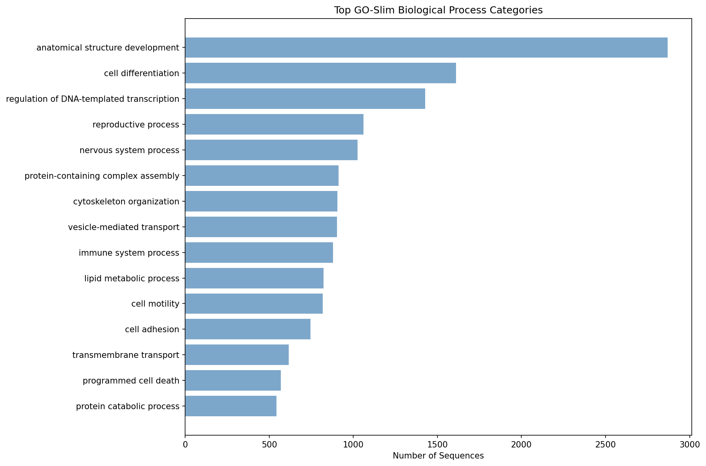

# Annotation Summary Report

## Job Information
- **Input file**: pycno-protein.fa
- **Start time**: 2026-03-07 12:31:24
- **End time**: 2026-03-07 13:49:34
- **Duration**: 1h 18m 10s
- **CPUs used**: 40
- **Tool**: BLAST+ BLASTP (protein)

## Results Overview
- **Total sequences**: 19,165
- **BLAST hits found**: 19,165 (100.0%)
- **GO annotations**: 9,212 (48.1%)
- **GO-Slim mappings**: 9,177 (47.9%)

## Output Files
- **Main results**: annotation_with_goslim.tsv
- **Full GO data**: annotation_full_go.tsv  
- **Raw BLAST**: pycno-protein.blast.tsv
- **Processing script**: postprocess_uniprot_go.py

## Top GO-Slim Categories

| GO-Slim Term | Count |
|--------------|-------|
| anatomical structure development | 2869 |
| cell differentiation | 1610 |
| regulation of DNA-templated transcription | 1428 |
| reproductive process | 1061 |
| nervous system process | 1026 |
| protein-containing complex assembly | 912 |
| cytoskeleton organization | 904 |
| vesicle-mediated transport | 902 |
| immune system process | 880 |
| lipid metabolic process | 824 |
| cell motility | 819 |
| cell adhesion | 745 |
| transmembrane transport | 616 |
| programmed cell death | 569 |
| protein catabolic process | 544 |

*Top 15 GO-Slim categories by sequence count*

## Performance
- **BLAST throughput**: 4.1 sequences/second
- **Annotation rate**: 4.1 hits/second

---
*Generated by blast2slim.sh on 2026-03-07 13:49:34*
